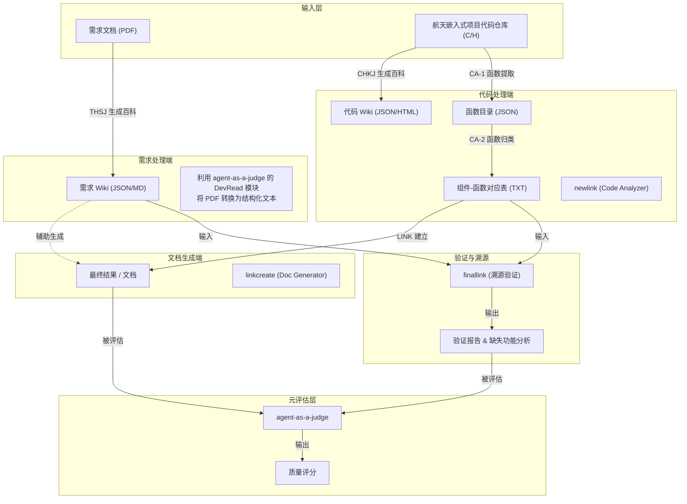

# Link 项目运行逻辑与架构分析

## 1. 项目概述

本项目是一个集成了**自动化代码分析**、**智能文档生成**、**需求溯源验证**以及**AI质量评估**的综合性嵌入式软件全生命周期管理系统。核心目标是通过 AI 技术打通“需求文档”与“源代码”之间的壁垒，实现自动化的双向验证与文档维护。

## 2. 系统运行全景图 (Logical Flow)

根据项目组件与运行逻辑，整个系统的数据流转如下：

## 3. 核心组件解析

### 3.1. PDF to JSON (THSJ/CHKJ 基础能力)
*   **对应组件**: `agent-as-a-judge/agent_as_a_judge/module/read.py` (DevRead)
*   **功能**: 这是整个系统的**“眼睛”**。它负责将非结构化的 PDF 需求文档（如 `CASC-STEC-PT005能力验证软件需求规格说明.pdf`）解析为机器可读的 JSON 或文本格式。
*   **关键逻辑**: 
    *   使用 `PyPDF2` 提取 PDF 文本。
    *   支持多格式读取（.txt, .c, .h, .docx, .md 等）。
    *   为后续的“百科生成”提供原始数据素材。

### 3.2. newlink (代码透视镜与分类器)
*   **对应逻辑**: 图中的 `CA-1` (函数提取) 和 `CA-2` (归类)。
*   **核心驱动**: 利用 **agent-as-a-judge** 的判别能力作为组件分类器。
*   **功能**: 逆向分析 C 语言代码库，并智能判断函数归属。
*   **流程**:
    1.  扫描 `.c/.h` 文件。
    2.  **分类判定 (Agent-as-a-Classifier)**: 利用 LLM (如 DeepSeek) 对每个函数进行语义分析，判断其是否属于某个特定组件（如 "这个函数是 ADC 组件的核心功能" 或 "与 ADC 无关"）。
    3.  输出结构化的函数列表（如 `output/ADC_functions.txt`），明确“哪个组件包含了哪些函数”。

### 3.3. linkcreate (文档生成器)
*   **对应逻辑**: 图中的 `CHKJ 生成百科` 或 `LINK 建立` 的文档化部分。
*   **功能**: 正向生成技术文档。
*   **流程**: 读取组件定义和技术数据，自动生成 Markdown 格式的标准技术文档。

### 3.4. finallink (闭环验证者)
*   **对应逻辑**: 图中的 `LINK 建立` (核心溯源逻辑)。
*   **功能**: 需求与代码的对齐验证。
*   **流程**:
    1.  读取需求 Wiki (来自 PDF)。
    2.  读取代码函数列表 (来自 newlink)。
    3.  利用 GPT-4 进行语义匹配，判断“某条需求是否被代码实现”。
    4.  生成详细的**溯源矩阵**和**缺失功能警告**。

### 3.5. agent-as-a-judge (裁判官与分类器)
*   **对应逻辑**: 
    1.  **全局监控 (Judge)**: 评估生成质量。
    2.  **组件归类 (Classifier)**: 深度参与 `newlink` 的 `CA-2` 环节，作为智能分类器判断代码功能的归属。
*   **功能**: 作为一个独立的评估与分类 Agent，它不仅对最终结果打分，更在过程中通过“判别”能力决定了函数的组件归属。

## 4. 总结
本项目通过 **DevRead (PDF解析)** -> **Newlink (代码分析)** -> **Finallink (需求溯源)** 形成了一个完整的 V 模型自动化闭环。它不仅能自动生成文档，更能自动检查代码是否符合需求，极大地提高了嵌入式软件开发的合规性与效率。
